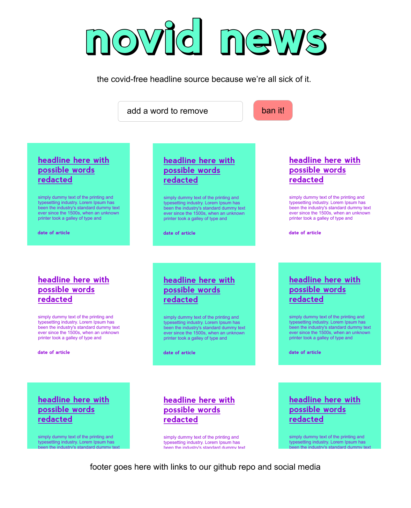
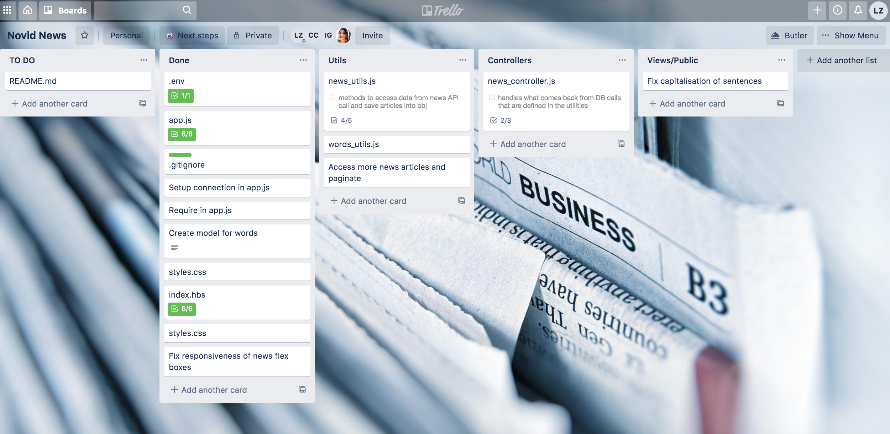
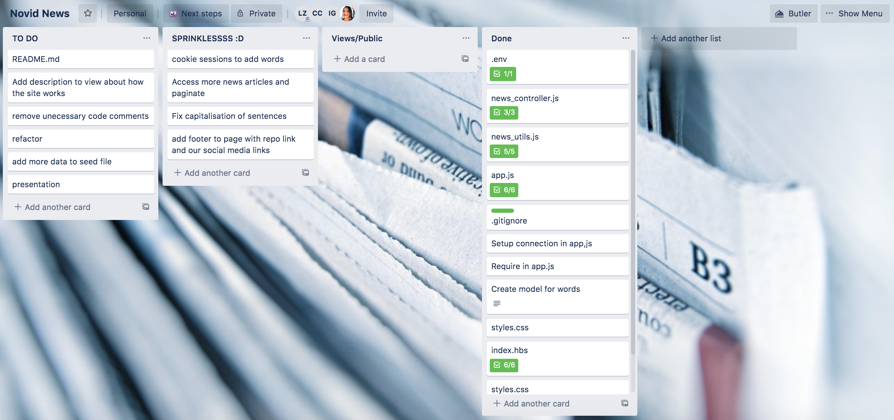
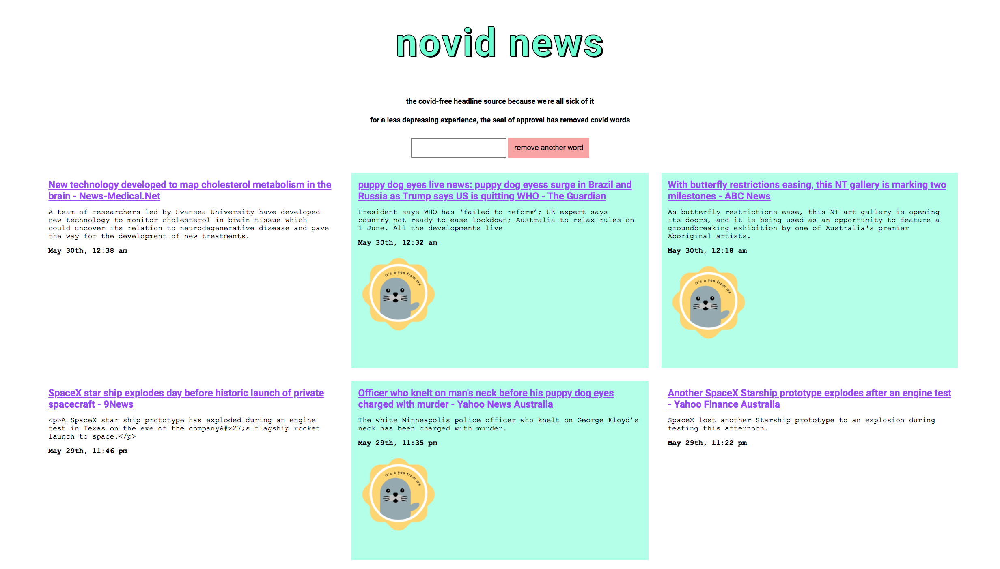
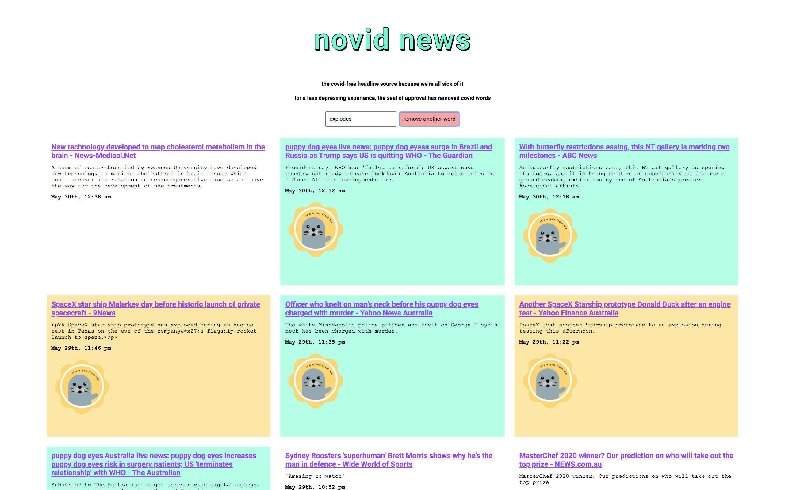

##NOVID News

An express app developed as part of the Coder Academy hackathon 2020. Theme: Post-pandemic.

##Contributors

- Louise Flanagan: https://github.com/Lou-Flan
- Catherine Calcolt-Stevens: https://github.com/catcstevens 
- Ignacio Giadach: https://github.com/igscl
- Luisa Ziccarelli: https://github.com/luisaziccarelli 

##Github repository: 

https://github.com/Lou-Flan/novid-news 

##Deployed App: 

https://novid-news.herokuapp.com/

##What is the problem this app is trying to solve?

During the coronavirus pandemic most people's lives has been affected in a number of different ways. For some people the overload exposure in the media with news and updates about the pandemic has had impacts on their mental health (i.e anxiety, isolation, problems sleeping, etc.). 

Novid news is a website for people interested in reading the news but who are sick and tired of seeing the words related to the pandemic (i.e "coronavirs", "covid"). 

The Novid news app is mean to bring a sense of humour and silliness into those user's daily life while still allowing them to stay informed and up to date with what is happening in the world.

##How does Novid news solves this problem? 

Novid news addresses this problem by creating a News front-page of the most recent news articles in Australia. The title, a description, the date it was published, and a link to the URL of the original article is displayed for each article. 

The front-page offers mix of safe articles (those with non related pandemic words) and unsafe articles (with pandemic related words). 

The safe articles have a different background color and a seal of approval. The safe articles have the pandemic related words swapped by random funny words. The non safe articles will still appear in the page and will remain unchanged. 

This functionality minimizes the exposure to pandemic related material and offers the users the power to choose which news they want to read. 

##Target Audience

Anyone interested in reading the news headlines from Australia online but feels overwhelmed and tired with the amount of news related to the pandemic. 

##User Stories 

 - As  a user I want to be able to get the most recent news headlines in Australia.
 - As a user I want to be able to see a mixture of articles that contain pandemic related news and non pandemic news.
 - As a user I want to be able to feel less overwhelmed and stressed when I read the news.
 - As a user I want to be able to a sense of control over the information I am exposed to.

##Tech stack:
Front-end: Javascript, SCSS.

Back-end: Node.js, Express.

Database: MongoDB.

Deployment: Heroku.

Biz Tools: Trello.

Third party services: NewsAPI

DevOps: Git, Github, VS Code.

##Wiregrames

##Trello

#Screenshots 

